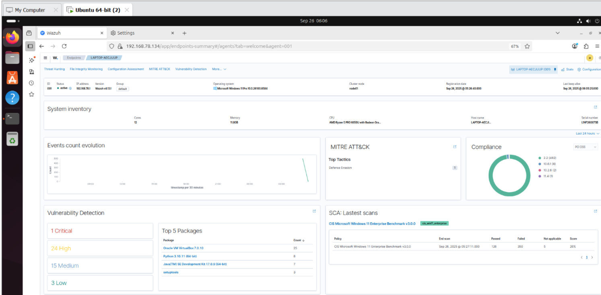

# WAZUH-SIEM-XDR-LAB

### ***2. Lab Architecture***

***Component*** | ***Host*** | ***Role***  
Wazuh Manager | Ubuntu (VirtualBox) | Collects, analyzes, and stores data from agents  
Wazuh Agent | Windows (host machine) | Sends logs and system events to the Wazuh manager


### ***3. Prerequisites***

- VirtualBox/VMWare installed  
- Ubuntu Server 20.04+ installed in VirtualBox (bridged networking)  
- Internet access on Ubuntu VM  
- Administrative access on the Windows host  
- Optional: basic knowledge of Linux and system administration

---

### ***4. Installing the Wazuh Manager (Ubuntu)***

Run the following steps on your Ubuntu VirtualBox/VMware server.

#### ***4.1 Add Wazuh GPG Key***
Via a terminal window:
```bash
curl -s https://packages.wazuh.com/key/GPG-KEY-WAZUH | sudo gpg --dearmor -o /usr/share/keyrings/wazuh-archive-keyring.gpg
```
This adds the GPG key to verify Wazuh packages.

#### ***4.2 Download and Execute Wazuh Installation Script***
```bash
curl -sO https://packages.wazuh.com/4.12/wazuh-install.sh && sudo bash ./wazuh-install.sh -a -i
```
- ***-a:*** Installs all components (manager, indexer.)  
- ***-i:*** Runs in interactive mode  


The script installs all required services and configures them automatically.

---

### ***5. Accessing the Wazuh Dashboard***

After installation:
1. Check your Ubuntu VM’s IP address:
   ```bash
   ip a
   ```
    
2. On your Ubuntu server, open a browser and go to:  
   `https://<ubuntu-vm-ip>`
3. Accept any browser security warning due to the self-signed certificate.
  
4. Log in using the credentials displayed at the end of the installation script.
 


---

### ***6. Installing the Wazuh Agent (Windows Host)***

1. Download the latest Wazuh agent MSI installer from the official documentation: **[Wazuh Agent for Windows](https://documentation.wazuh.com/current/installation-guide/wazuh-agent/wazuh-agent-package-windows.html)**  
2. Install the MSI package on your Windows system using the default settings.

---

### ***7. Registering the Agent with the Manager***

#### ***7.1 Generate Agent Key on Ubuntu Manager***
Run the agent management utility:
```bash
sudo /var/ossec/bin/manage_agents
```
- Select ***A*** to add an agent.  
- Assign a name (e.g., ***WindowsHost***).  
- input the ip address of host windows machine.  
- After creation, select ***E*** to extract the key.  
- Copy the key output.


#### ***7.2 Apply Key in the Windows Agent***
1. Open **Wazuh Agent Manager** GUI from the Start Menu.  
2. Paste the copied key into the appropriate field.  
3. Save and apply the key.  
4. Add the manager's IP address (IP address of your Ubuntu manager). 
 
5. Restart the agent service.  


You can then go to the **Wazuh dashboard** and see the agent onboarded.





---

### ***8. File Integrity Monitoring on Windows***

Wazuh supports real-time monitoring of file and folder changes using **Syscheck**.

#### ***8.1 Edit Agent Configuration***
Open the following configuration file:  
`C:\Program Files (x86)\ossec-agent\ossec.conf`


Add the following entry inside the **Directory** block:
```bash
<directories realtime="yes">C:\Users\abc\Test</directories>
```


This monitors the specified folder in real-time (I will choose to monitor the downloaded folder in users/kwame amponsah/)


#### ***8.2 Restart the Agent***
After saving the changes, restart the Wazuh agentservice to apply the configuration.


---

### ***9. Verifying Setup***

1. Open the **Wazuh Dashboard** in your browser.  
2. Navigate to **Agents** → ensure the Windows agent is listed and status is **Active**. 
 
3. Go to the **Integrity Monitoring** section.  

4. Perform actions (create/modify/delete files) in the monitored folder.  
5. Confirm that alerts appear in the dashboard.

